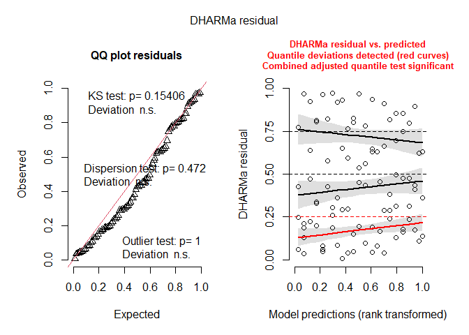
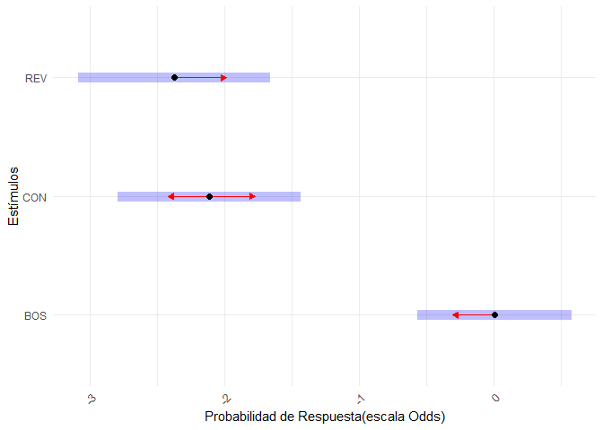

Trabajo_Final
================
Grupo_14
2024-11-13

# Abstract

Los Modelos Lineales Generalizados han permitido abordar los más
diversos temas en Biología, ya que abren un abanico de modelos para
estudiar relaciones. Cada tema en Biología puede tener un modelo
asociado y es separable en variables o cantidades, que pueden ser
clasificadas según su distribución de probabilidad. En este trabajo se
abordó la percepción de estímulos auditivos dentro de una especie de
aves. En particular, se estudiaron algunas propiedades del estímulo
sonoro (si contiene o no ciertos patrones), y su relación con la
respuesta del ave receptora. Dado que la forma de medir la respuesta es
a nivel neuronal y depende de algunas variables técnicas, también se
incluyó en el modelo a estas variables. Entonces, se buscó una relación
entre la presencia de los patrones sonoros (Estímulo), las variables
técnicas y la respuesta en las aves receptoras, pero sólo se halló
evidencia significativa para la presencia de patrones (dentro de éstos,
para el canto del propio ave). No fue significativa para patrones
conteniendo otras combinaciones de elementos sonoros, ni lo fue para
distintas combinaciones de las variables técnicas. Lo encontrado está
dentro de lo esperado biológicamente, y existe la posibilidad que alguna
de las variables explicativas pueda ser significativa, al experimentar
con mayor cantidad de Aves.

# Introducción

La producción de comportamientos complejos implica una interacción
profunda entre el sistema nervioso, los sistemas periféricos y el
entorno. Un ejemplo de ello es el canto de las aves oscinas (aves que
aprenden su canto de un tutor), que surge de instrucciones neuronales
que coordinan el sistema respiratorio y el aparato vocal. Las aves
oscinas son un modelo útil para estudiar la base neuronal del
aprendizaje y producción de vocalizaciones complejas.  
El “sistema del canto” es un circuito de núcleos cerebrales
especializado en la ejecución y aprendizaje del canto (Nottebohm et al.,
1982; Wild, 2004), el cual diferencia aves oscinas de aquellas que no
aprenden su canto socialmente (Kroodsma & Konishi, 1991). Dentro de este
sistema, el núcleo telencefálico HVC ha recibido especial atención por
su rol en la percepción y producción del canto (Brenowitz, 1991; Gentner
et al., 2000). En HVC se identificaron por primera vez neuronas
selectivas al canto propio (BOS, por sus siglas en inglés Bird’s Own
Song), que responden con mayor intensidad al canto propio que a otros
estímulos auditivos, sean simples o tan complejos como el canto de un
individuo de la misma especie (Margoliash, 1983, 1985; Margoliash &
Fortune, 1992). Esta selectividad también se observa durante el sueño y
bajo diferentes tipos de anestesia (Doupe, 1997; Mooney, 2000), aunque
las respuestas en vigilia suelen ser menos selectivas que durante el
sueño (Rauske et al., 2003).  
Nuestro modelo animal es el canario doméstico, Serinus canaria. Su canto
presenta una estructura compleja, compuesta por la repetición de sílabas
conformadas por 1 o 2 notas. Los canarios macho tienen un repertorio de
20 a 30 frases, aunque solo una parte se presenta en cada canto, siendo
más probables unas que otras (Lehongre et al., 2008). El conjunto de
frases que canta con mayor probabilidad se denomina BOS (Bird’s Own
Song, canto propio). Si bien algunas frases se producen en un orden
relativamente fijo, el repertorio no es rígido y varía entre individuos,
con algunas frases específicas de cada ave y otras compartidas entre
machos en el mismo o diferente aviario (Lehongre et al., 2009). Esto
hace del canario una especie muy interesante para estudiar, dada la
complejidad de su canto.  
Pocos estudios han evaluado si el estímulo BOS evoca consistentemente
excitación en el HVC de canarios despiertos en estado de reposo y si
esta respuesta posee las mismas características observadas en otras
especies. Los registros neuronales en canarios durante la vigilia datan
de hace 30 años, en los inicios de la neurociencia en aves canoras
(McCasland & Konishi, 1981).  
Nuestro objetivo será testear, estadísticamente, si las neuronas en HVC
de Serinus canaria poseen respuestas selectivas al BOS respecto de otros
estímulos (CON y REV), tal cual se observó en otras aves canoras,
teniendo en cuenta la similitud posible entre cantos de distintos
individuos de la especie.  
Hipótesis y predicciones

# Métodos

## Métodos experimentales

Se realizaron registros de actividad neuronal extracelular en el núcleo
HVC de canarios macho (Serinus canaria) despiertos y en libre
comportamiento (N=5). Se utilizó un arreglo de tetrodos manualmente
ajustable que permitió registros crónicos en profundidades variables (0
y +23.5 micrómetros), con cuatro tetrodos en cada sitio.  
Los estímulos auditivos reproducidos incluyeron 20 presentaciones
aleatorizadas de:  
1. BOS (Bird’s Own Song): grabación del propio canto del ave,
determinado identificando las frases más comunes del individuo de un
total de 100 grabaciones (tratamiento)  
2. CON: canto de un conspecífico (otro individuo de la misma especie),
seleccionado con el criterio de que sea lo más diferente posible al BOS
(control 1)  
3. REV: BOS invertido temporalmente, conserva la estructura espectral
(control 2).  
Preprocesamiento de los datos

• La señal de voltaje de cada tetrodo fue filtrada para aislar las
espigas neuronales de las oscilaciones lentas.  
• Los disparos neuronales fueron detectados mediante un umbral mínimo y
se analizaron con histogramas y curvas de densidad de probabilidad
(kernel).  
• La actividad basal se definió como la mediana de los valores de las
curvas en los silencios previos al estímulo, y se consideró respuesta
positiva a la actividad neuronal que duplica la actividad basal durante
el canto.  
• Se calculó la proporción de frases con respuesta neuronal sobre el
total de frases para cada estímulo.

# Análisis estadísticos

# Resultados

# Exploracion del data frame

``` r
str(conteo_frases) # ¿cuál es la estructura de la base?
```

    ## tibble [93 × 7] (S3: tbl_df/tbl/data.frame)
    ##  $ Ave         : chr [1:93] "VioAzu" "VioAzu" "VioAzu" "VioAzu" ...
    ##  $ MUA         : num [1:93] 1 1 1 2 2 2 3 3 3 4 ...
    ##  $ Profundidad : num [1:93] 0 0 0 0 0 0 0 0 0 0 ...
    ##  $ Tetrodo     : num [1:93] 1 1 1 2 2 2 3 3 3 4 ...
    ##  $ Estímulo    : chr [1:93] "BOS" "CON" "REV" "BOS" ...
    ##  $ Conteo      : num [1:93] 4 2 0 3 2 0 3 2 0 3 ...
    ##  $ Frases_total: num [1:93] 11 12 11 11 12 11 11 12 11 11 ...

``` r
class(conteo_frases) # qué tipo de objeto es?
```

    ## [1] "tbl_df"     "tbl"        "data.frame"

``` r
dim(conteo_frases) # qué dimensiones tiene?
```

    ## [1] 93  7

``` r
head(conteo_frases) # muestra las primeras filas
```

    ## # A tibble: 6 × 7
    ##   Ave      MUA Profundidad Tetrodo Estímulo Conteo Frases_total
    ##   <chr>  <dbl>       <dbl>   <dbl> <chr>     <dbl>        <dbl>
    ## 1 VioAzu     1           0       1 BOS           4           11
    ## 2 VioAzu     1           0       1 CON           2           12
    ## 3 VioAzu     1           0       1 REV           0           11
    ## 4 VioAzu     2           0       2 BOS           3           11
    ## 5 VioAzu     2           0       2 CON           2           12
    ## 6 VioAzu     2           0       2 REV           0           11

``` r
tail(conteo_frases) #  muestra las últimas
```

    ## # A tibble: 6 × 7
    ##   Ave      MUA Profundidad Tetrodo Estímulo Conteo Frases_total
    ##   <chr>  <dbl>       <dbl>   <dbl> <chr>     <dbl>        <dbl>
    ## 1 VioVio     6        23.5       2 BOS           8           11
    ## 2 VioVio     6        23.5       2 CON           1           13
    ## 3 VioVio     6        23.5       2 REV           4           11
    ## 4 VioVio     8        23.5       4 BOS           5           11
    ## 5 VioVio     8        23.5       4 CON           0           13
    ## 6 VioVio     8        23.5       4 REV           3           11

``` r
summary(conteo_frases) # resume a cada variable
```

    ##      Ave                 MUA          Profundidad        Tetrodo     
    ##  Length:93          Min.   : 1.000   Min.   : 0.000   Min.   :1.000  
    ##  Class :character   1st Qu.: 2.000   1st Qu.: 0.000   1st Qu.:1.000  
    ##  Mode  :character   Median : 4.000   Median : 0.000   Median :2.000  
    ##                     Mean   : 4.355   Mean   : 9.855   Mean   :2.516  
    ##                     3rd Qu.: 6.000   3rd Qu.:23.500   3rd Qu.:4.000  
    ##                     Max.   :13.000   Max.   :23.500   Max.   :4.000  
    ##    Estímulo             Conteo        Frases_total  
    ##  Length:93          Min.   : 0.000   Min.   :10.00  
    ##  Class :character   1st Qu.: 0.000   1st Qu.:11.00  
    ##  Mode  :character   Median : 2.000   Median :13.00  
    ##                     Mean   : 2.796   Mean   :12.32  
    ##                     3rd Qu.: 4.000   3rd Qu.:14.00  
    ##                     Max.   :11.000   Max.   :14.00

# Exploracion preliminar de los datos

# Calcular la Proporcion de conteo por frases totales

``` r
conteo_frases <- conteo_frases %>%
  mutate( .keep="all", Proporcion = conteo_frases$Conteo / conteo_frases$Frases_total)
```

# Crear el plot

``` r
ggplot(conteo_frases, aes(x = Estímulo, y = Proporcion, group = interaction(Profundidad, Tetrodo, Ave), color = Ave)) +
  geom_line() +  #  Líneas que conectan los puntos para cada combinación de Ave, Profundidad y Tetrodo
  geom_point() +  #  Puntos para cada estímulo
  labs(title = "Proporciones de Conteo por Estímulo",
       x = "Estímulo",
       y = "Proporcion (Conteo / Frases Totales)",
       color = "Ave") +
  theme_minimal() +  #  Tema para estética del gráfico
  theme(axis.text.x = element_text(angle = 45, hjust = 1))  #  Rotación de etiquetas en x para legibilidad
```

<!-- -->

# Crear la variable no-respuesta

``` r
conteo_frases$NR <- conteo_frases$Frases_total - conteo_frases$Conteo
```

## \## Modelo con interaccion

# Ajustar el modelo con una distribución beta-binomial (Modelo con interaccion)

``` r
m1 <- glmmTMB(
  cbind(Conteo, NR) ~ Estímulo*as.factor(Profundidad)*as.factor(Tetrodo) + (1|Ave),
  data = conteo_frases,
  family = betabinomial(link = "logit")
)
```

# Verificar si hay sobre- o subdispersión

``` r
rp1 <- resid(m1, type = "pearson") #  residuos de Pearson
pearson_chisq1 <- sum(rp1^2) 
df_res1 <- m1$df.residual
dispersion_ratio1 <- pearson_chisq1 / df_res1
dispersion_ratio1
```

    ## numeric(0)

# PH para sobredispersion chi2

``` r
check_overdispersion(m1)
```

    ## # Overdispersion test
    ## 
    ##  dispersion ratio = 0.850
    ##           p-value = 0.472

    ## No overdispersion detected.

# Supuestos con Dharma

``` r
simulationOutput1 <- simulateResiduals(fittedModel = m1, plot = T)
```

<!-- -->

``` r
hist(simulationOutput1)
```

<!-- -->

``` r
testDispersion(simulationOutput1)
```

<!-- -->

    ## 
    ##  DHARMa nonparametric dispersion test via sd of residuals fitted vs.
    ##  simulated
    ## 
    ## data:  simulationOutput
    ## dispersion = 0.84965, p-value = 0.472
    ## alternative hypothesis: two.sided

``` r
shapiro.test(rp1)
```

    ## 
    ##  Shapiro-Wilk normality test
    ## 
    ## data:  rp1
    ## W = 0.93543, p-value = 0.0001824

Observación de resultados

``` r
summary(m1)
```

    ##  Family: betabinomial  ( logit )
    ## Formula:          
    ## cbind(Conteo, NR) ~ Estímulo * as.factor(Profundidad) * as.factor(Tetrodo) +  
    ##     (1 | Ave)
    ## Data: conteo_frases
    ## 
    ##      AIC      BIC   logLik deviance df.resid 
    ##    358.4    424.3   -153.2    306.4       67 
    ## 
    ## Random effects:
    ## 
    ## Conditional model:
    ##  Groups Name        Variance Std.Dev.
    ##  Ave    (Intercept) 0.3174   0.5634  
    ## Number of obs: 93, groups:  Ave, 5
    ## 
    ## Dispersion parameter for betabinomial family (): 18.7 
    ## 
    ## Conditional model:
    ##                                                            Estimate Std. Error
    ## (Intercept)                                                 0.08342    0.44724
    ## EstímuloCON                                                -3.48345    1.06887
    ## EstímuloREV                                                -3.72942    1.09018
    ## as.factor(Profundidad)23.5                                 -0.45075    0.52584
    ## as.factor(Tetrodo)2                                        -0.36236    0.49682
    ## as.factor(Tetrodo)3                                        -0.38008    0.52264
    ## as.factor(Tetrodo)4                                        -0.16404    0.49174
    ## EstímuloCON:as.factor(Profundidad)23.5                      1.97881    1.24466
    ## EstímuloREV:as.factor(Profundidad)23.5                      1.77099    1.33757
    ## EstímuloCON:as.factor(Tetrodo)2                             0.97849    1.29074
    ## EstímuloREV:as.factor(Tetrodo)2                             0.41475    1.45751
    ## EstímuloCON:as.factor(Tetrodo)3                             1.81303    1.27203
    ## EstímuloREV:as.factor(Tetrodo)3                             1.42784    1.37603
    ## EstímuloCON:as.factor(Tetrodo)4                             1.91212    1.19537
    ## EstímuloREV:as.factor(Tetrodo)4                             2.32487    1.20954
    ## as.factor(Profundidad)23.5:as.factor(Tetrodo)2              1.19348    0.76592
    ## as.factor(Profundidad)23.5:as.factor(Tetrodo)3              1.11710    0.82866
    ## as.factor(Profundidad)23.5:as.factor(Tetrodo)4              0.67485    0.72791
    ## EstímuloCON:as.factor(Profundidad)23.5:as.factor(Tetrodo)2 -2.42862    1.67696
    ## EstímuloREV:as.factor(Profundidad)23.5:as.factor(Tetrodo)2 -1.10364    1.84512
    ## EstímuloCON:as.factor(Profundidad)23.5:as.factor(Tetrodo)3 -1.77711    1.64148
    ## EstímuloREV:as.factor(Profundidad)23.5:as.factor(Tetrodo)3 -1.13993    1.81350
    ## EstímuloCON:as.factor(Profundidad)23.5:as.factor(Tetrodo)4 -2.20631    1.50874
    ## EstímuloREV:as.factor(Profundidad)23.5:as.factor(Tetrodo)4 -2.36545    1.58545
    ##                                                            z value Pr(>|z|)    
    ## (Intercept)                                                  0.187 0.852037    
    ## EstímuloCON                                                 -3.259 0.001118 ** 
    ## EstímuloREV                                                 -3.421 0.000624 ***
    ## as.factor(Profundidad)23.5                                  -0.857 0.391334    
    ## as.factor(Tetrodo)2                                         -0.729 0.465782    
    ## as.factor(Tetrodo)3                                         -0.727 0.467089    
    ## as.factor(Tetrodo)4                                         -0.334 0.738694    
    ## EstímuloCON:as.factor(Profundidad)23.5                       1.590 0.111870    
    ## EstímuloREV:as.factor(Profundidad)23.5                       1.324 0.185491    
    ## EstímuloCON:as.factor(Tetrodo)2                              0.758 0.448400    
    ## EstímuloREV:as.factor(Tetrodo)2                              0.285 0.775981    
    ## EstímuloCON:as.factor(Tetrodo)3                              1.425 0.154069    
    ## EstímuloREV:as.factor(Tetrodo)3                              1.038 0.299432    
    ## EstímuloCON:as.factor(Tetrodo)4                              1.600 0.109688    
    ## EstímuloREV:as.factor(Tetrodo)4                              1.922 0.054592 .  
    ## as.factor(Profundidad)23.5:as.factor(Tetrodo)2               1.558 0.119181    
    ## as.factor(Profundidad)23.5:as.factor(Tetrodo)3               1.348 0.177632    
    ## as.factor(Profundidad)23.5:as.factor(Tetrodo)4               0.927 0.353870    
    ## EstímuloCON:as.factor(Profundidad)23.5:as.factor(Tetrodo)2  -1.448 0.147553    
    ## EstímuloREV:as.factor(Profundidad)23.5:as.factor(Tetrodo)2  -0.598 0.549748    
    ## EstímuloCON:as.factor(Profundidad)23.5:as.factor(Tetrodo)3  -1.083 0.278974    
    ## EstímuloREV:as.factor(Profundidad)23.5:as.factor(Tetrodo)3  -0.629 0.529623    
    ## EstímuloCON:as.factor(Profundidad)23.5:as.factor(Tetrodo)4  -1.462 0.143644    
    ## EstímuloREV:as.factor(Profundidad)23.5:as.factor(Tetrodo)4  -1.492 0.135706    
    ## ---
    ## Signif. codes:  0 '***' 0.001 '**' 0.01 '*' 0.05 '.' 0.1 ' ' 1

``` r
drop1(m1, test="Chisq")
```

    ## Single term deletions
    ## 
    ## Model:
    ## cbind(Conteo, NR) ~ Estímulo * as.factor(Profundidad) * as.factor(Tetrodo) + 
    ##     (1 | Ave)
    ##                                                    Df    AIC    LRT Pr(>Chi)
    ## <none>                                                358.42                
    ## Estímulo:as.factor(Profundidad):as.factor(Tetrodo)  6 351.09 4.6704   0.5867

``` r
Anova(m1, type = "III")
```

    ## Analysis of Deviance Table (Type III Wald chisquare tests)
    ## 
    ## Response: cbind(Conteo, NR)
    ##                                                      Chisq Df Pr(>Chisq)    
    ## (Intercept)                                         0.0348  1     0.8520    
    ## Estímulo                                           19.8802  2   4.82e-05 ***
    ## as.factor(Profundidad)                              0.7348  1     0.3913    
    ## as.factor(Tetrodo)                                  0.7513  3     0.8611    
    ## Estímulo:as.factor(Profundidad)                     3.6775  2     0.1590    
    ## Estímulo:as.factor(Tetrodo)                         7.6775  6     0.2627    
    ## as.factor(Profundidad):as.factor(Tetrodo)           2.9337  3     0.4020    
    ## Estímulo:as.factor(Profundidad):as.factor(Tetrodo)  4.4970  6     0.6097    
    ## ---
    ## Signif. codes:  0 '***' 0.001 '**' 0.01 '*' 0.05 '.' 0.1 ' ' 1

``` r
alfai1 <- ranef(m1)
```

## QQ plot

Crear un QQ Plot con título y etiquetas personalizadas para los ejes

``` r
car::qqPlot(alfai1$cond$Ave$`(Intercept)`,
            main = "QQ Plot de los Efectos Aleatorios del Ave",
            xlab = "Cuantiles Teóricos",
            ylab = "Cuantiles Muestrales")
```

<!-- -->

    ## [1] 5 4

``` r
tab_model(m1)
```

<table style="border-collapse:collapse; border:none;">
<tr>
<th style="border-top: double; text-align:center; font-style:normal; font-weight:bold; padding:0.2cm;  text-align:left; ">
 
</th>
<th colspan="3" style="border-top: double; text-align:center; font-style:normal; font-weight:bold; padding:0.2cm; ">
cbind(Conteo, NR)
</th>
</tr>
<tr>
<td style=" text-align:center; border-bottom:1px solid; font-style:italic; font-weight:normal;  text-align:left; ">
Predictors
</td>
<td style=" text-align:center; border-bottom:1px solid; font-style:italic; font-weight:normal;  ">
Odds Ratios
</td>
<td style=" text-align:center; border-bottom:1px solid; font-style:italic; font-weight:normal;  ">
CI
</td>
<td style=" text-align:center; border-bottom:1px solid; font-style:italic; font-weight:normal;  ">
p
</td>
</tr>
<tr>
<td style=" padding:0.2cm; text-align:left; vertical-align:top; text-align:left; ">
(Intercept)
</td>
<td style=" padding:0.2cm; text-align:left; vertical-align:top; text-align:center;  ">
1.09
</td>
<td style=" padding:0.2cm; text-align:left; vertical-align:top; text-align:center;  ">
0.45 – 2.61
</td>
<td style=" padding:0.2cm; text-align:left; vertical-align:top; text-align:center;  ">
0.852
</td>
</tr>
<tr>
<td style=" padding:0.2cm; text-align:left; vertical-align:top; text-align:left; ">
Estímulo \[CON\]
</td>
<td style=" padding:0.2cm; text-align:left; vertical-align:top; text-align:center;  ">
0.03
</td>
<td style=" padding:0.2cm; text-align:left; vertical-align:top; text-align:center;  ">
0.00 – 0.25
</td>
<td style=" padding:0.2cm; text-align:left; vertical-align:top; text-align:center;  ">
<strong>0.001</strong>
</td>
</tr>
<tr>
<td style=" padding:0.2cm; text-align:left; vertical-align:top; text-align:left; ">
Estímulo \[REV\]
</td>
<td style=" padding:0.2cm; text-align:left; vertical-align:top; text-align:center;  ">
0.02
</td>
<td style=" padding:0.2cm; text-align:left; vertical-align:top; text-align:center;  ">
0.00 – 0.20
</td>
<td style=" padding:0.2cm; text-align:left; vertical-align:top; text-align:center;  ">
<strong>0.001</strong>
</td>
</tr>
<tr>
<td style=" padding:0.2cm; text-align:left; vertical-align:top; text-align:left; ">
Profundidad \[23.5\]
</td>
<td style=" padding:0.2cm; text-align:left; vertical-align:top; text-align:center;  ">
0.64
</td>
<td style=" padding:0.2cm; text-align:left; vertical-align:top; text-align:center;  ">
0.23 – 1.79
</td>
<td style=" padding:0.2cm; text-align:left; vertical-align:top; text-align:center;  ">
0.391
</td>
</tr>
<tr>
<td style=" padding:0.2cm; text-align:left; vertical-align:top; text-align:left; ">
Tetrodo \[2\]
</td>
<td style=" padding:0.2cm; text-align:left; vertical-align:top; text-align:center;  ">
0.70
</td>
<td style=" padding:0.2cm; text-align:left; vertical-align:top; text-align:center;  ">
0.26 – 1.84
</td>
<td style=" padding:0.2cm; text-align:left; vertical-align:top; text-align:center;  ">
0.466
</td>
</tr>
<tr>
<td style=" padding:0.2cm; text-align:left; vertical-align:top; text-align:left; ">
Tetrodo \[3\]
</td>
<td style=" padding:0.2cm; text-align:left; vertical-align:top; text-align:center;  ">
0.68
</td>
<td style=" padding:0.2cm; text-align:left; vertical-align:top; text-align:center;  ">
0.25 – 1.90
</td>
<td style=" padding:0.2cm; text-align:left; vertical-align:top; text-align:center;  ">
0.467
</td>
</tr>
<tr>
<td style=" padding:0.2cm; text-align:left; vertical-align:top; text-align:left; ">
Tetrodo \[4\]
</td>
<td style=" padding:0.2cm; text-align:left; vertical-align:top; text-align:center;  ">
0.85
</td>
<td style=" padding:0.2cm; text-align:left; vertical-align:top; text-align:center;  ">
0.32 – 2.22
</td>
<td style=" padding:0.2cm; text-align:left; vertical-align:top; text-align:center;  ">
0.739
</td>
</tr>
<tr>
<td style=" padding:0.2cm; text-align:left; vertical-align:top; text-align:left; ">
Estímulo \[CON\] ×<br>Profundidad \[23.5\]
</td>
<td style=" padding:0.2cm; text-align:left; vertical-align:top; text-align:center;  ">
7.23
</td>
<td style=" padding:0.2cm; text-align:left; vertical-align:top; text-align:center;  ">
0.63 – 82.95
</td>
<td style=" padding:0.2cm; text-align:left; vertical-align:top; text-align:center;  ">
0.112
</td>
</tr>
<tr>
<td style=" padding:0.2cm; text-align:left; vertical-align:top; text-align:left; ">
Estímulo \[REV\] ×<br>Profundidad \[23.5\]
</td>
<td style=" padding:0.2cm; text-align:left; vertical-align:top; text-align:center;  ">
5.88
</td>
<td style=" padding:0.2cm; text-align:left; vertical-align:top; text-align:center;  ">
0.43 – 80.85
</td>
<td style=" padding:0.2cm; text-align:left; vertical-align:top; text-align:center;  ">
0.185
</td>
</tr>
<tr>
<td style=" padding:0.2cm; text-align:left; vertical-align:top; text-align:left; ">
Estímulo \[CON\] × Tetrodo<br>\[2\]
</td>
<td style=" padding:0.2cm; text-align:left; vertical-align:top; text-align:center;  ">
2.66
</td>
<td style=" padding:0.2cm; text-align:left; vertical-align:top; text-align:center;  ">
0.21 – 33.39
</td>
<td style=" padding:0.2cm; text-align:left; vertical-align:top; text-align:center;  ">
0.448
</td>
</tr>
<tr>
<td style=" padding:0.2cm; text-align:left; vertical-align:top; text-align:left; ">
Estímulo \[REV\] × Tetrodo<br>\[2\]
</td>
<td style=" padding:0.2cm; text-align:left; vertical-align:top; text-align:center;  ">
1.51
</td>
<td style=" padding:0.2cm; text-align:left; vertical-align:top; text-align:center;  ">
0.09 – 26.35
</td>
<td style=" padding:0.2cm; text-align:left; vertical-align:top; text-align:center;  ">
0.776
</td>
</tr>
<tr>
<td style=" padding:0.2cm; text-align:left; vertical-align:top; text-align:left; ">
Estímulo \[CON\] × Tetrodo<br>\[3\]
</td>
<td style=" padding:0.2cm; text-align:left; vertical-align:top; text-align:center;  ">
6.13
</td>
<td style=" padding:0.2cm; text-align:left; vertical-align:top; text-align:center;  ">
0.51 – 74.16
</td>
<td style=" padding:0.2cm; text-align:left; vertical-align:top; text-align:center;  ">
0.154
</td>
</tr>
<tr>
<td style=" padding:0.2cm; text-align:left; vertical-align:top; text-align:left; ">
Estímulo \[REV\] × Tetrodo<br>\[3\]
</td>
<td style=" padding:0.2cm; text-align:left; vertical-align:top; text-align:center;  ">
4.17
</td>
<td style=" padding:0.2cm; text-align:left; vertical-align:top; text-align:center;  ">
0.28 – 61.86
</td>
<td style=" padding:0.2cm; text-align:left; vertical-align:top; text-align:center;  ">
0.299
</td>
</tr>
<tr>
<td style=" padding:0.2cm; text-align:left; vertical-align:top; text-align:left; ">
Estímulo \[CON\] × Tetrodo<br>\[4\]
</td>
<td style=" padding:0.2cm; text-align:left; vertical-align:top; text-align:center;  ">
6.77
</td>
<td style=" padding:0.2cm; text-align:left; vertical-align:top; text-align:center;  ">
0.65 – 70.46
</td>
<td style=" padding:0.2cm; text-align:left; vertical-align:top; text-align:center;  ">
0.110
</td>
</tr>
<tr>
<td style=" padding:0.2cm; text-align:left; vertical-align:top; text-align:left; ">
Estímulo \[REV\] × Tetrodo<br>\[4\]
</td>
<td style=" padding:0.2cm; text-align:left; vertical-align:top; text-align:center;  ">
10.23
</td>
<td style=" padding:0.2cm; text-align:left; vertical-align:top; text-align:center;  ">
0.96 – 109.46
</td>
<td style=" padding:0.2cm; text-align:left; vertical-align:top; text-align:center;  ">
0.055
</td>
</tr>
<tr>
<td style=" padding:0.2cm; text-align:left; vertical-align:top; text-align:left; ">
Profundidad \[23.5\] × as<br>Tetrodo2
</td>
<td style=" padding:0.2cm; text-align:left; vertical-align:top; text-align:center;  ">
3.30
</td>
<td style=" padding:0.2cm; text-align:left; vertical-align:top; text-align:center;  ">
0.74 – 14.80
</td>
<td style=" padding:0.2cm; text-align:left; vertical-align:top; text-align:center;  ">
0.119
</td>
</tr>
<tr>
<td style=" padding:0.2cm; text-align:left; vertical-align:top; text-align:left; ">
Profundidad \[23.5\] × as<br>Tetrodo3
</td>
<td style=" padding:0.2cm; text-align:left; vertical-align:top; text-align:center;  ">
3.06
</td>
<td style=" padding:0.2cm; text-align:left; vertical-align:top; text-align:center;  ">
0.60 – 15.51
</td>
<td style=" padding:0.2cm; text-align:left; vertical-align:top; text-align:center;  ">
0.178
</td>
</tr>
<tr>
<td style=" padding:0.2cm; text-align:left; vertical-align:top; text-align:left; ">
Profundidad \[23.5\] × as<br>Tetrodo4
</td>
<td style=" padding:0.2cm; text-align:left; vertical-align:top; text-align:center;  ">
1.96
</td>
<td style=" padding:0.2cm; text-align:left; vertical-align:top; text-align:center;  ">
0.47 – 8.18
</td>
<td style=" padding:0.2cm; text-align:left; vertical-align:top; text-align:center;  ">
0.354
</td>
</tr>
<tr>
<td style=" padding:0.2cm; text-align:left; vertical-align:top; text-align:left; ">
Estímulo \[CON\] ×<br>Profundidad \[23.5\] × as<br>Tetrodo2
</td>
<td style=" padding:0.2cm; text-align:left; vertical-align:top; text-align:center;  ">
0.09
</td>
<td style=" padding:0.2cm; text-align:left; vertical-align:top; text-align:center;  ">
0.00 – 2.36
</td>
<td style=" padding:0.2cm; text-align:left; vertical-align:top; text-align:center;  ">
0.148
</td>
</tr>
<tr>
<td style=" padding:0.2cm; text-align:left; vertical-align:top; text-align:left; ">
Estímulo \[REV\] ×<br>Profundidad \[23.5\] × as<br>Tetrodo2
</td>
<td style=" padding:0.2cm; text-align:left; vertical-align:top; text-align:center;  ">
0.33
</td>
<td style=" padding:0.2cm; text-align:left; vertical-align:top; text-align:center;  ">
0.01 – 12.34
</td>
<td style=" padding:0.2cm; text-align:left; vertical-align:top; text-align:center;  ">
0.550
</td>
</tr>
<tr>
<td style=" padding:0.2cm; text-align:left; vertical-align:top; text-align:left; ">
Estímulo \[CON\] ×<br>Profundidad \[23.5\] × as<br>Tetrodo3
</td>
<td style=" padding:0.2cm; text-align:left; vertical-align:top; text-align:center;  ">
0.17
</td>
<td style=" padding:0.2cm; text-align:left; vertical-align:top; text-align:center;  ">
0.01 – 4.22
</td>
<td style=" padding:0.2cm; text-align:left; vertical-align:top; text-align:center;  ">
0.279
</td>
</tr>
<tr>
<td style=" padding:0.2cm; text-align:left; vertical-align:top; text-align:left; ">
Estímulo \[REV\] ×<br>Profundidad \[23.5\] × as<br>Tetrodo3
</td>
<td style=" padding:0.2cm; text-align:left; vertical-align:top; text-align:center;  ">
0.32
</td>
<td style=" padding:0.2cm; text-align:left; vertical-align:top; text-align:center;  ">
0.01 – 11.18
</td>
<td style=" padding:0.2cm; text-align:left; vertical-align:top; text-align:center;  ">
0.530
</td>
</tr>
<tr>
<td style=" padding:0.2cm; text-align:left; vertical-align:top; text-align:left; ">
Estímulo \[CON\] ×<br>Profundidad \[23.5\] × as<br>Tetrodo4
</td>
<td style=" padding:0.2cm; text-align:left; vertical-align:top; text-align:center;  ">
0.11
</td>
<td style=" padding:0.2cm; text-align:left; vertical-align:top; text-align:center;  ">
0.01 – 2.12
</td>
<td style=" padding:0.2cm; text-align:left; vertical-align:top; text-align:center;  ">
0.144
</td>
</tr>
<tr>
<td style=" padding:0.2cm; text-align:left; vertical-align:top; text-align:left; ">
Estímulo \[REV\] ×<br>Profundidad \[23.5\] × as<br>Tetrodo4
</td>
<td style=" padding:0.2cm; text-align:left; vertical-align:top; text-align:center;  ">
0.09
</td>
<td style=" padding:0.2cm; text-align:left; vertical-align:top; text-align:center;  ">
0.00 – 2.10
</td>
<td style=" padding:0.2cm; text-align:left; vertical-align:top; text-align:center;  ">
0.136
</td>
</tr>
<tr>
<td colspan="4" style="font-weight:bold; text-align:left; padding-top:.8em;">
Random Effects
</td>
</tr>
<tr>
<td style=" padding:0.2cm; text-align:left; vertical-align:top; text-align:left; padding-top:0.1cm; padding-bottom:0.1cm;">
σ<sup>2</sup>
</td>
<td style=" padding:0.2cm; text-align:left; vertical-align:top; padding-top:0.1cm; padding-bottom:0.1cm; text-align:left;" colspan="3">
0.16
</td>
</tr>
<tr>
<td style=" padding:0.2cm; text-align:left; vertical-align:top; text-align:left; padding-top:0.1cm; padding-bottom:0.1cm;">
τ<sub>00</sub> <sub>Ave</sub>
</td>
<td style=" padding:0.2cm; text-align:left; vertical-align:top; padding-top:0.1cm; padding-bottom:0.1cm; text-align:left;" colspan="3">
0.32
</td>
<tr>
<td style=" padding:0.2cm; text-align:left; vertical-align:top; text-align:left; padding-top:0.1cm; padding-bottom:0.1cm;">
ICC
</td>
<td style=" padding:0.2cm; text-align:left; vertical-align:top; padding-top:0.1cm; padding-bottom:0.1cm; text-align:left;" colspan="3">
0.66
</td>
<tr>
<td style=" padding:0.2cm; text-align:left; vertical-align:top; text-align:left; padding-top:0.1cm; padding-bottom:0.1cm;">
N <sub>Ave</sub>
</td>
<td style=" padding:0.2cm; text-align:left; vertical-align:top; padding-top:0.1cm; padding-bottom:0.1cm; text-align:left;" colspan="3">
5
</td>
<tr>
<td style=" padding:0.2cm; text-align:left; vertical-align:top; text-align:left; padding-top:0.1cm; padding-bottom:0.1cm; border-top:1px solid;">
Observations
</td>
<td style=" padding:0.2cm; text-align:left; vertical-align:top; padding-top:0.1cm; padding-bottom:0.1cm; text-align:left; border-top:1px solid;" colspan="3">
93
</td>
</tr>
<tr>
<td style=" padding:0.2cm; text-align:left; vertical-align:top; text-align:left; padding-top:0.1cm; padding-bottom:0.1cm;">
Marginal R<sup>2</sup> / Conditional R<sup>2</sup>
</td>
<td style=" padding:0.2cm; text-align:left; vertical-align:top; padding-top:0.1cm; padding-bottom:0.1cm; text-align:left;" colspan="3">
0.766 / 0.921
</td>
</tr>
</table>

Ajustar el modelo con una distribución beta-binomial (Interaccion
estimulo, profundidad)

``` r
m2 <- glmmTMB(
  cbind(Conteo, NR) ~ Estímulo*as.factor(Profundidad) + as.factor(Tetrodo) + (1|Ave),
  data = conteo_frases,
  family = betabinomial(link = "logit")
)
```

Verificar si hay sobre- o sub-dispersión

``` r
rp2 <- resid(m2, type = "pearson") #  residuos de Pearson
pearson_chisq2 <- sum(rp2^2) 
df_res2 <- m2$df.residual
dispersion_ratio2 <- pearson_chisq2 / df_res2
dispersion_ratio2
```

    ## numeric(0)

PH para sobredispersion chi2

``` r
check_overdispersion(m2)
```

    ## # Overdispersion test
    ## 
    ##  dispersion ratio = 0.834
    ##           p-value = 0.392

    ## No overdispersion detected.

Supuestos para usar Dharma

``` r
simulationOutput2 <- simulateResiduals(fittedModel = m2, plot = T)
```

<!-- -->

``` r
hist(simulationOutput2)
```

<!-- -->

``` r
testDispersion(simulationOutput2)
```

<!-- -->

    ## 
    ##  DHARMa nonparametric dispersion test via sd of residuals fitted vs.
    ##  simulated
    ## 
    ## data:  simulationOutput
    ## dispersion = 0.83363, p-value = 0.392
    ## alternative hypothesis: two.sided

Observación de resultados

``` r
summary(m2)
```

    ##  Family: betabinomial  ( logit )
    ## Formula:          
    ## cbind(Conteo, NR) ~ Estímulo * as.factor(Profundidad) + as.factor(Tetrodo) +  
    ##     (1 | Ave)
    ## Data: conteo_frases
    ## 
    ##      AIC      BIC   logLik deviance df.resid 
    ##    341.1    369.0   -159.6    319.1       82 
    ## 
    ## Random effects:
    ## 
    ## Conditional model:
    ##  Groups Name        Variance Std.Dev.
    ##  Ave    (Intercept) 0.2622   0.512   
    ## Number of obs: 93, groups:  Ave, 5
    ## 
    ## Dispersion parameter for betabinomial family (): 11.9 
    ## 
    ## Conditional model:
    ##                                        Estimate Std. Error z value Pr(>|z|)    
    ## (Intercept)                            -0.40973    0.36241  -1.131   0.2582    
    ## EstímuloCON                            -2.10206    0.36575  -5.747 9.07e-09 ***
    ## EstímuloREV                            -2.40580    0.39810  -6.043 1.51e-09 ***
    ## as.factor(Profundidad)23.5              0.21930    0.30304   0.724   0.4693    
    ## as.factor(Tetrodo)2                     0.06582    0.31306   0.210   0.8335    
    ## as.factor(Tetrodo)3                     0.39114    0.34628   1.130   0.2587    
    ## as.factor(Tetrodo)4                     0.54682    0.29697   1.841   0.0656 .  
    ## EstímuloCON:as.factor(Profundidad)23.5  0.25940    0.52816   0.491   0.6233    
    ## EstímuloREV:as.factor(Profundidad)23.5  0.29458    0.58107   0.507   0.6122    
    ## ---
    ## Signif. codes:  0 '***' 0.001 '**' 0.01 '*' 0.05 '.' 0.1 ' ' 1

``` r
Anova(m2, type = "III")
```

    ## Analysis of Deviance Table (Type III Wald chisquare tests)
    ## 
    ## Response: cbind(Conteo, NR)
    ##                                   Chisq Df Pr(>Chisq)    
    ## (Intercept)                      1.2781  1     0.2582    
    ## Estímulo                        55.6491  2  8.241e-13 ***
    ## as.factor(Profundidad)           0.5237  1     0.4693    
    ## as.factor(Tetrodo)               4.5555  3     0.2074    
    ## Estímulo:as.factor(Profundidad)  0.3894  2     0.8231    
    ## ---
    ## Signif. codes:  0 '***' 0.001 '**' 0.01 '*' 0.05 '.' 0.1 ' ' 1

``` r
alfai2 <- ranef(m2)
```

## QQ plot

# Crear un QQ Plot con título y etiquetas personalizadas para los ejes

``` r
car::qqPlot(alfai2$cond$Ave$`(Intercept)`,
            main = "QQ Plot de los Efectos Aleatorios del Ave",
            xlab = "Cuantiles Teóricos",
            ylab = "Cuantiles Muestrales")
```

<!-- -->

    ## [1] 5 4

``` r
tab_model(m2)
```

<table style="border-collapse:collapse; border:none;">
<tr>
<th style="border-top: double; text-align:center; font-style:normal; font-weight:bold; padding:0.2cm;  text-align:left; ">
 
</th>
<th colspan="3" style="border-top: double; text-align:center; font-style:normal; font-weight:bold; padding:0.2cm; ">
cbind(Conteo, NR)
</th>
</tr>
<tr>
<td style=" text-align:center; border-bottom:1px solid; font-style:italic; font-weight:normal;  text-align:left; ">
Predictors
</td>
<td style=" text-align:center; border-bottom:1px solid; font-style:italic; font-weight:normal;  ">
Odds Ratios
</td>
<td style=" text-align:center; border-bottom:1px solid; font-style:italic; font-weight:normal;  ">
CI
</td>
<td style=" text-align:center; border-bottom:1px solid; font-style:italic; font-weight:normal;  ">
p
</td>
</tr>
<tr>
<td style=" padding:0.2cm; text-align:left; vertical-align:top; text-align:left; ">
(Intercept)
</td>
<td style=" padding:0.2cm; text-align:left; vertical-align:top; text-align:center;  ">
0.66
</td>
<td style=" padding:0.2cm; text-align:left; vertical-align:top; text-align:center;  ">
0.33 – 1.35
</td>
<td style=" padding:0.2cm; text-align:left; vertical-align:top; text-align:center;  ">
0.258
</td>
</tr>
<tr>
<td style=" padding:0.2cm; text-align:left; vertical-align:top; text-align:left; ">
Estímulo \[CON\]
</td>
<td style=" padding:0.2cm; text-align:left; vertical-align:top; text-align:center;  ">
0.12
</td>
<td style=" padding:0.2cm; text-align:left; vertical-align:top; text-align:center;  ">
0.06 – 0.25
</td>
<td style=" padding:0.2cm; text-align:left; vertical-align:top; text-align:center;  ">
<strong>\<0.001</strong>
</td>
</tr>
<tr>
<td style=" padding:0.2cm; text-align:left; vertical-align:top; text-align:left; ">
Estímulo \[REV\]
</td>
<td style=" padding:0.2cm; text-align:left; vertical-align:top; text-align:center;  ">
0.09
</td>
<td style=" padding:0.2cm; text-align:left; vertical-align:top; text-align:center;  ">
0.04 – 0.20
</td>
<td style=" padding:0.2cm; text-align:left; vertical-align:top; text-align:center;  ">
<strong>\<0.001</strong>
</td>
</tr>
<tr>
<td style=" padding:0.2cm; text-align:left; vertical-align:top; text-align:left; ">
Profundidad \[23.5\]
</td>
<td style=" padding:0.2cm; text-align:left; vertical-align:top; text-align:center;  ">
1.25
</td>
<td style=" padding:0.2cm; text-align:left; vertical-align:top; text-align:center;  ">
0.69 – 2.26
</td>
<td style=" padding:0.2cm; text-align:left; vertical-align:top; text-align:center;  ">
0.469
</td>
</tr>
<tr>
<td style=" padding:0.2cm; text-align:left; vertical-align:top; text-align:left; ">
Tetrodo \[2\]
</td>
<td style=" padding:0.2cm; text-align:left; vertical-align:top; text-align:center;  ">
1.07
</td>
<td style=" padding:0.2cm; text-align:left; vertical-align:top; text-align:center;  ">
0.58 – 1.97
</td>
<td style=" padding:0.2cm; text-align:left; vertical-align:top; text-align:center;  ">
0.833
</td>
</tr>
<tr>
<td style=" padding:0.2cm; text-align:left; vertical-align:top; text-align:left; ">
Tetrodo \[3\]
</td>
<td style=" padding:0.2cm; text-align:left; vertical-align:top; text-align:center;  ">
1.48
</td>
<td style=" padding:0.2cm; text-align:left; vertical-align:top; text-align:center;  ">
0.75 – 2.91
</td>
<td style=" padding:0.2cm; text-align:left; vertical-align:top; text-align:center;  ">
0.259
</td>
</tr>
<tr>
<td style=" padding:0.2cm; text-align:left; vertical-align:top; text-align:left; ">
Tetrodo \[4\]
</td>
<td style=" padding:0.2cm; text-align:left; vertical-align:top; text-align:center;  ">
1.73
</td>
<td style=" padding:0.2cm; text-align:left; vertical-align:top; text-align:center;  ">
0.97 – 3.09
</td>
<td style=" padding:0.2cm; text-align:left; vertical-align:top; text-align:center;  ">
0.066
</td>
</tr>
<tr>
<td style=" padding:0.2cm; text-align:left; vertical-align:top; text-align:left; ">
Estímulo \[CON\] ×<br>Profundidad \[23.5\]
</td>
<td style=" padding:0.2cm; text-align:left; vertical-align:top; text-align:center;  ">
1.30
</td>
<td style=" padding:0.2cm; text-align:left; vertical-align:top; text-align:center;  ">
0.46 – 3.65
</td>
<td style=" padding:0.2cm; text-align:left; vertical-align:top; text-align:center;  ">
0.623
</td>
</tr>
<tr>
<td style=" padding:0.2cm; text-align:left; vertical-align:top; text-align:left; ">
Estímulo \[REV\] ×<br>Profundidad \[23.5\]
</td>
<td style=" padding:0.2cm; text-align:left; vertical-align:top; text-align:center;  ">
1.34
</td>
<td style=" padding:0.2cm; text-align:left; vertical-align:top; text-align:center;  ">
0.43 – 4.19
</td>
<td style=" padding:0.2cm; text-align:left; vertical-align:top; text-align:center;  ">
0.612
</td>
</tr>
<tr>
<td colspan="4" style="font-weight:bold; text-align:left; padding-top:.8em;">
Random Effects
</td>
</tr>
<tr>
<td style=" padding:0.2cm; text-align:left; vertical-align:top; text-align:left; padding-top:0.1cm; padding-bottom:0.1cm;">
σ<sup>2</sup>
</td>
<td style=" padding:0.2cm; text-align:left; vertical-align:top; padding-top:0.1cm; padding-bottom:0.1cm; text-align:left;" colspan="3">
0.24
</td>
</tr>
<tr>
<td style=" padding:0.2cm; text-align:left; vertical-align:top; text-align:left; padding-top:0.1cm; padding-bottom:0.1cm;">
τ<sub>00</sub> <sub>Ave</sub>
</td>
<td style=" padding:0.2cm; text-align:left; vertical-align:top; padding-top:0.1cm; padding-bottom:0.1cm; text-align:left;" colspan="3">
0.26
</td>
<tr>
<td style=" padding:0.2cm; text-align:left; vertical-align:top; text-align:left; padding-top:0.1cm; padding-bottom:0.1cm;">
ICC
</td>
<td style=" padding:0.2cm; text-align:left; vertical-align:top; padding-top:0.1cm; padding-bottom:0.1cm; text-align:left;" colspan="3">
0.52
</td>
<tr>
<td style=" padding:0.2cm; text-align:left; vertical-align:top; text-align:left; padding-top:0.1cm; padding-bottom:0.1cm;">
N <sub>Ave</sub>
</td>
<td style=" padding:0.2cm; text-align:left; vertical-align:top; padding-top:0.1cm; padding-bottom:0.1cm; text-align:left;" colspan="3">
5
</td>
<tr>
<td style=" padding:0.2cm; text-align:left; vertical-align:top; text-align:left; padding-top:0.1cm; padding-bottom:0.1cm; border-top:1px solid;">
Observations
</td>
<td style=" padding:0.2cm; text-align:left; vertical-align:top; padding-top:0.1cm; padding-bottom:0.1cm; text-align:left; border-top:1px solid;" colspan="3">
93
</td>
</tr>
<tr>
<td style=" padding:0.2cm; text-align:left; vertical-align:top; text-align:left; padding-top:0.1cm; padding-bottom:0.1cm;">
Marginal R<sup>2</sup> / Conditional R<sup>2</sup>
</td>
<td style=" padding:0.2cm; text-align:left; vertical-align:top; padding-top:0.1cm; padding-bottom:0.1cm; text-align:left;" colspan="3">
0.694 / 0.854
</td>
</tr>
</table>

## \# Modelo aditivo

``` r
m3 <- glmmTMB(
  cbind(Conteo, NR) ~ Estímulo + as.factor(Profundidad) + as.factor(Tetrodo) + (1|Ave),
  data = conteo_frases,
  family = betabinomial(link = "logit")
)
```

# Verificar si hay sobre- o subdispersión

``` r
rp3 <- resid(m3, type = "pearson") #  residuos de Pearson
pearson_chisq3 <- sum(rp3^2) 
df_res3 <- m3$df.residual
dispersion_ratio3 <- pearson_chisq3 / df_res3
dispersion_ratio3
```

    ## numeric(0)

# PH para sobredispersion chi2

``` r
check_overdispersion(m3)
```

    ## # Overdispersion test
    ## 
    ##  dispersion ratio = 0.838
    ##           p-value =  0.48

    ## No overdispersion detected.

# Supuestos con Dharma

``` r
simulationOutput3 <- simulateResiduals(fittedModel = m3, plot = T)
```

<!-- -->

``` r
hist(simulationOutput3)
```

<!-- -->

``` r
testDispersion(simulationOutput3)
```

<!-- -->

    ## 
    ##  DHARMa nonparametric dispersion test via sd of residuals fitted vs.
    ##  simulated
    ## 
    ## data:  simulationOutput
    ## dispersion = 0.83751, p-value = 0.48
    ## alternative hypothesis: two.sided

Observación de resultados

``` r
summary(m3)
```

    ##  Family: betabinomial  ( logit )
    ## Formula:          
    ## cbind(Conteo, NR) ~ Estímulo + as.factor(Profundidad) + as.factor(Tetrodo) +  
    ##     (1 | Ave)
    ## Data: conteo_frases
    ## 
    ##      AIC      BIC   logLik deviance df.resid 
    ##    337.5    360.3   -159.8    319.5       84 
    ## 
    ## Random effects:
    ## 
    ## Conditional model:
    ##  Groups Name        Variance Std.Dev.
    ##  Ave    (Intercept) 0.262    0.5119  
    ## Number of obs: 93, groups:  Ave, 5
    ## 
    ## Dispersion parameter for betabinomial family (): 11.9 
    ## 
    ## Conditional model:
    ##                            Estimate Std. Error z value Pr(>|z|)    
    ## (Intercept)                 -0.4636     0.3533  -1.312   0.1895    
    ## EstímuloCON                 -1.9860     0.2712  -7.322 2.44e-13 ***
    ## EstímuloREV                 -2.2758     0.2910  -7.820 5.28e-15 ***
    ## as.factor(Profundidad)23.5   0.3402     0.2325   1.463   0.1434    
    ## as.factor(Tetrodo)2          0.0700     0.3140   0.223   0.8236    
    ## as.factor(Tetrodo)3          0.3940     0.3468   1.136   0.2559    
    ## as.factor(Tetrodo)4          0.5547     0.2979   1.862   0.0626 .  
    ## ---
    ## Signif. codes:  0 '***' 0.001 '**' 0.01 '*' 0.05 '.' 0.1 ' ' 1

``` r
Anova(m3, type = "III")
```

    ## Analysis of Deviance Table (Type III Wald chisquare tests)
    ## 
    ## Response: cbind(Conteo, NR)
    ##                          Chisq Df Pr(>Chisq)    
    ## (Intercept)             1.7217  1     0.1895    
    ## Estímulo               89.6839  2     <2e-16 ***
    ## as.factor(Profundidad)  2.1411  1     0.1434    
    ## as.factor(Tetrodo)      4.6444  3     0.1998    
    ## ---
    ## Signif. codes:  0 '***' 0.001 '**' 0.01 '*' 0.05 '.' 0.1 ' ' 1

``` r
alfai3 <- ranef(m3)
```

## \# QQ plot

# Crear un QQ Plot con título y etiquetas personalizadas para los ejes

``` r
car::qqPlot(alfai3$cond$Ave$`(Intercept)`,
            main = "QQ Plot de los Efectos Aleatorios del Ave",
            xlab = "Cuantiles Teóricos",
            ylab = "Cuantiles Muestrales")
```

<!-- -->

    ## [1] 5 4

``` r
tab_model(m3)
```

<table style="border-collapse:collapse; border:none;">
<tr>
<th style="border-top: double; text-align:center; font-style:normal; font-weight:bold; padding:0.2cm;  text-align:left; ">
 
</th>
<th colspan="3" style="border-top: double; text-align:center; font-style:normal; font-weight:bold; padding:0.2cm; ">
cbind(Conteo, NR)
</th>
</tr>
<tr>
<td style=" text-align:center; border-bottom:1px solid; font-style:italic; font-weight:normal;  text-align:left; ">
Predictors
</td>
<td style=" text-align:center; border-bottom:1px solid; font-style:italic; font-weight:normal;  ">
Odds Ratios
</td>
<td style=" text-align:center; border-bottom:1px solid; font-style:italic; font-weight:normal;  ">
CI
</td>
<td style=" text-align:center; border-bottom:1px solid; font-style:italic; font-weight:normal;  ">
p
</td>
</tr>
<tr>
<td style=" padding:0.2cm; text-align:left; vertical-align:top; text-align:left; ">
(Intercept)
</td>
<td style=" padding:0.2cm; text-align:left; vertical-align:top; text-align:center;  ">
0.63
</td>
<td style=" padding:0.2cm; text-align:left; vertical-align:top; text-align:center;  ">
0.31 – 1.26
</td>
<td style=" padding:0.2cm; text-align:left; vertical-align:top; text-align:center;  ">
0.189
</td>
</tr>
<tr>
<td style=" padding:0.2cm; text-align:left; vertical-align:top; text-align:left; ">
Estímulo \[CON\]
</td>
<td style=" padding:0.2cm; text-align:left; vertical-align:top; text-align:center;  ">
0.14
</td>
<td style=" padding:0.2cm; text-align:left; vertical-align:top; text-align:center;  ">
0.08 – 0.23
</td>
<td style=" padding:0.2cm; text-align:left; vertical-align:top; text-align:center;  ">
<strong>\<0.001</strong>
</td>
</tr>
<tr>
<td style=" padding:0.2cm; text-align:left; vertical-align:top; text-align:left; ">
Estímulo \[REV\]
</td>
<td style=" padding:0.2cm; text-align:left; vertical-align:top; text-align:center;  ">
0.10
</td>
<td style=" padding:0.2cm; text-align:left; vertical-align:top; text-align:center;  ">
0.06 – 0.18
</td>
<td style=" padding:0.2cm; text-align:left; vertical-align:top; text-align:center;  ">
<strong>\<0.001</strong>
</td>
</tr>
<tr>
<td style=" padding:0.2cm; text-align:left; vertical-align:top; text-align:left; ">
Profundidad \[23.5\]
</td>
<td style=" padding:0.2cm; text-align:left; vertical-align:top; text-align:center;  ">
1.41
</td>
<td style=" padding:0.2cm; text-align:left; vertical-align:top; text-align:center;  ">
0.89 – 2.22
</td>
<td style=" padding:0.2cm; text-align:left; vertical-align:top; text-align:center;  ">
0.143
</td>
</tr>
<tr>
<td style=" padding:0.2cm; text-align:left; vertical-align:top; text-align:left; ">
Tetrodo \[2\]
</td>
<td style=" padding:0.2cm; text-align:left; vertical-align:top; text-align:center;  ">
1.07
</td>
<td style=" padding:0.2cm; text-align:left; vertical-align:top; text-align:center;  ">
0.58 – 1.98
</td>
<td style=" padding:0.2cm; text-align:left; vertical-align:top; text-align:center;  ">
0.824
</td>
</tr>
<tr>
<td style=" padding:0.2cm; text-align:left; vertical-align:top; text-align:left; ">
Tetrodo \[3\]
</td>
<td style=" padding:0.2cm; text-align:left; vertical-align:top; text-align:center;  ">
1.48
</td>
<td style=" padding:0.2cm; text-align:left; vertical-align:top; text-align:center;  ">
0.75 – 2.93
</td>
<td style=" padding:0.2cm; text-align:left; vertical-align:top; text-align:center;  ">
0.256
</td>
</tr>
<tr>
<td style=" padding:0.2cm; text-align:left; vertical-align:top; text-align:left; ">
Tetrodo \[4\]
</td>
<td style=" padding:0.2cm; text-align:left; vertical-align:top; text-align:center;  ">
1.74
</td>
<td style=" padding:0.2cm; text-align:left; vertical-align:top; text-align:center;  ">
0.97 – 3.12
</td>
<td style=" padding:0.2cm; text-align:left; vertical-align:top; text-align:center;  ">
0.063
</td>
</tr>
<tr>
<td colspan="4" style="font-weight:bold; text-align:left; padding-top:.8em;">
Random Effects
</td>
</tr>
<tr>
<td style=" padding:0.2cm; text-align:left; vertical-align:top; text-align:left; padding-top:0.1cm; padding-bottom:0.1cm;">
σ<sup>2</sup>
</td>
<td style=" padding:0.2cm; text-align:left; vertical-align:top; padding-top:0.1cm; padding-bottom:0.1cm; text-align:left;" colspan="3">
0.24
</td>
</tr>
<tr>
<td style=" padding:0.2cm; text-align:left; vertical-align:top; text-align:left; padding-top:0.1cm; padding-bottom:0.1cm;">
τ<sub>00</sub> <sub>Ave</sub>
</td>
<td style=" padding:0.2cm; text-align:left; vertical-align:top; padding-top:0.1cm; padding-bottom:0.1cm; text-align:left;" colspan="3">
0.26
</td>
<tr>
<td style=" padding:0.2cm; text-align:left; vertical-align:top; text-align:left; padding-top:0.1cm; padding-bottom:0.1cm;">
ICC
</td>
<td style=" padding:0.2cm; text-align:left; vertical-align:top; padding-top:0.1cm; padding-bottom:0.1cm; text-align:left;" colspan="3">
0.52
</td>
<tr>
<td style=" padding:0.2cm; text-align:left; vertical-align:top; text-align:left; padding-top:0.1cm; padding-bottom:0.1cm;">
N <sub>Ave</sub>
</td>
<td style=" padding:0.2cm; text-align:left; vertical-align:top; padding-top:0.1cm; padding-bottom:0.1cm; text-align:left;" colspan="3">
5
</td>
<tr>
<td style=" padding:0.2cm; text-align:left; vertical-align:top; text-align:left; padding-top:0.1cm; padding-bottom:0.1cm; border-top:1px solid;">
Observations
</td>
<td style=" padding:0.2cm; text-align:left; vertical-align:top; padding-top:0.1cm; padding-bottom:0.1cm; text-align:left; border-top:1px solid;" colspan="3">
93
</td>
</tr>
<tr>
<td style=" padding:0.2cm; text-align:left; vertical-align:top; text-align:left; padding-top:0.1cm; padding-bottom:0.1cm;">
Marginal R<sup>2</sup> / Conditional R<sup>2</sup>
</td>
<td style=" padding:0.2cm; text-align:left; vertical-align:top; padding-top:0.1cm; padding-bottom:0.1cm; text-align:left;" colspan="3">
0.690 / 0.852
</td>
</tr>
</table>

# Comparacion de modelos

``` r
AIC(m1, m2, m3)
```

    ##    df      AIC
    ## m1 26 358.4153
    ## m2 11 341.1300
    ## m3  9 337.5193

# Comparaciones de medias marginales (Tukey) para Estímulo

``` r
Comp <- emmeans(m3, pairwise ~ Estímulo, adjust = "tukey")
summary(Comp)
```

    ## $emmeans
    ##  Estímulo  emmean    SE  df asymp.LCL asymp.UCL
    ##  BOS      -0.0388 0.276 Inf    -0.579     0.501
    ##  CON      -2.0249 0.323 Inf    -2.658    -1.392
    ##  REV      -2.3146 0.344 Inf    -2.989    -1.640
    ## 
    ## Results are averaged over the levels of: Profundidad, Tetrodo 
    ## Results are given on the logit (not the response) scale. 
    ## Confidence level used: 0.95 
    ## 
    ## $contrasts
    ##  contrast  estimate    SE  df z.ratio p.value
    ##  BOS - CON     1.99 0.271 Inf   7.322  <.0001
    ##  BOS - REV     2.28 0.291 Inf   7.820  <.0001
    ##  CON - REV     0.29 0.338 Inf   0.858  0.6665
    ## 
    ## Results are averaged over the levels of: Profundidad, Tetrodo 
    ## Results are given on the log odds ratio (not the response) scale. 
    ## P value adjustment: tukey method for comparing a family of 3 estimates

``` r
plot(Comp, comparisons = TRUE)
```

<!-- -->

``` r
confint(Comp)
```

    ## $emmeans
    ##  Estímulo  emmean    SE  df asymp.LCL asymp.UCL
    ##  BOS      -0.0388 0.276 Inf    -0.579     0.501
    ##  CON      -2.0249 0.323 Inf    -2.658    -1.392
    ##  REV      -2.3146 0.344 Inf    -2.989    -1.640
    ## 
    ## Results are averaged over the levels of: Profundidad, Tetrodo 
    ## Results are given on the logit (not the response) scale. 
    ## Confidence level used: 0.95 
    ## 
    ## $contrasts
    ##  contrast  estimate    SE  df asymp.LCL asymp.UCL
    ##  BOS - CON     1.99 0.271 Inf     1.350      2.62
    ##  BOS - REV     2.28 0.291 Inf     1.594      2.96
    ##  CON - REV     0.29 0.338 Inf    -0.501      1.08
    ## 
    ## Results are averaged over the levels of: Profundidad, Tetrodo 
    ## Results are given on the log odds ratio (not the response) scale. 
    ## Confidence level used: 0.95 
    ## Conf-level adjustment: tukey method for comparing a family of 3 estimates

# Gráfico de medias marginales con intervalos de confianza en escala del predictor lineal

``` r
estad2 <- as.data.frame(Comp$emmeans)

ggplot(estad2, aes(x = Estímulo, y = emmean)) + 
  geom_errorbar(aes(ymin = asymp.LCL, ymax = asymp.UCL), width = 0.1) +
  geom_point(colour = "blue", size = 3) +
  ylab("Estimación del Logit (Media Marginal)") + 
  theme_grey(base_size = 16) +
  annotate("text", x = c(1, 2, 3), y = c(4.2, 5.3, 3.5), label = c("A", "B", "B"))
```

<!-- -->

# Comparaciones en la escala original de la variable de respuesta (Proporcion, en tu caso)

``` r
Comp2 <- emmeans(m3, pairwise ~ Estímulo, type = "response")
Comp2
```

    ## $emmeans
    ##  Estímulo   prob     SE  df asymp.LCL asymp.UCL
    ##  BOS      0.4903 0.0689 Inf    0.3592     0.623
    ##  CON      0.1166 0.0333 Inf    0.0655     0.199
    ##  REV      0.0899 0.0282 Inf    0.0479     0.162
    ## 
    ## Results are averaged over the levels of: Profundidad, Tetrodo 
    ## Confidence level used: 0.95 
    ## Intervals are back-transformed from the logit scale 
    ## 
    ## $contrasts
    ##  contrast  odds.ratio    SE  df null z.ratio p.value
    ##  BOS / CON       7.29 1.980 Inf    1   7.322  <.0001
    ##  BOS / REV       9.74 2.830 Inf    1   7.820  <.0001
    ##  CON / REV       1.34 0.451 Inf    1   0.858  0.6665
    ## 
    ## Results are averaged over the levels of: Profundidad, Tetrodo 
    ## P value adjustment: tukey method for comparing a family of 3 estimates 
    ## Tests are performed on the log odds ratio scale

``` r
confint(Comp2)
```

    ## $emmeans
    ##  Estímulo   prob     SE  df asymp.LCL asymp.UCL
    ##  BOS      0.4903 0.0689 Inf    0.3592     0.623
    ##  CON      0.1166 0.0333 Inf    0.0655     0.199
    ##  REV      0.0899 0.0282 Inf    0.0479     0.162
    ## 
    ## Results are averaged over the levels of: Profundidad, Tetrodo 
    ## Confidence level used: 0.95 
    ## Intervals are back-transformed from the logit scale 
    ## 
    ## $contrasts
    ##  contrast  odds.ratio    SE  df asymp.LCL asymp.UCL
    ##  BOS / CON       7.29 1.980 Inf     3.859     13.76
    ##  BOS / REV       9.74 2.830 Inf     4.922     19.26
    ##  CON / REV       1.34 0.451 Inf     0.606      2.95
    ## 
    ## Results are averaged over the levels of: Profundidad, Tetrodo 
    ## Confidence level used: 0.95 
    ## Conf-level adjustment: tukey method for comparing a family of 3 estimates 
    ## Intervals are back-transformed from the log odds ratio scale

# Gráfico de medias marginales con IC en escala de la respuesta

``` r
estad <- as.data.frame(Comp2$emmeans)

ggplot(estad, aes(x = Estímulo, y = prob)) + 
  geom_errorbar(aes(ymin = asymp.LCL, ymax = asymp.UCL), width = 0.1) +
  geom_point(colour = "blue", size = 3) +
  ylab("Proporcion estimada de frases con respuesta") + 
  theme_grey(base_size = 16) +
  annotate("text", x = c(1, 2, 3), y = c(0.8, 0.9, 0.7), label = c("A", "B", "B"))
```

<!-- -->

# Discusión

En este trabajo se abordó la percepción de estímulos auditivos dentro de
una especie de aves. La forma de medir la respuesta fue a nivel
neuronal, y la técnica dependía de algunas variables técnicas. Se buscó
una relación entre la presencia del Estímulo, las variables técnicas y
la respuesta en las aves receptoras, pero sólo se halló evidencia
significativa para la presencia de patrones (dentro de éstos, para el
canto del propio ave). No fue significativa para patrones conteniendo
otras combinaciones de elementos sonoros, ni lo fue para distintas
combinaciones de las variables técnicas. Lo encontrado está dentro de lo
esperado biológicamente, aunque todavía podría existir una relación más
similar a la del modelo inicial. Es decir, existe la posibilidad que
alguna de las variables explicativas pueda dar resultados
significativos, si se experimentase con mayor cantidad de Aves.

# Referencias

1.  Brenowitz E. A. (1991). Altered perception of species-specific song
    by female birds after lesions of a forebrain nucleus. Science (New
    York, N.Y.), 251(4991), 303–305.
    <https://doi.org/10.1126/science.1987645>  
2.  Doupe, A. J. and Solis, M. M. Song (1997) And order-selective
    neurons develop in the songbird anterior forebrain during vocal
    learning. J Neurobiol, 33(5):694–709  
3.  Gentner, T.Q., Hulse, S.H., Bentley, G.E., Ball, G.F. (2000).
    Individual vocal recognition and the effect of partial lesions to
    HVc on discrimination, learning, and categorization of conspecific
    song in adult songbirds. J. Neurobiol. 42, 117–133.  
4.  Kroodsma D, Konishi M. (1991). A suboscine bird (eastern phoebe,
    Sayornis phoebe) develops normal song without auditory feedback.
    Anim Behav 42: 477–484.  
5.  Lehongre, K., Aubin, T., Robin, S., Del Negro, C., (2008).
    Individual signature in canary songs: contribution of multiple
    levels of song structure. Ethology 114, 425–435.  
6.  Lehongre, K., Del Negro, C., (2009). Repertoire sharing and auditory
    responses in the HVC of the canary. Neuroreport 20, 202–206.  
7.  Margoliash, D. (1983). Acoustic parameters underlying the responses
    of song-specific neurons in the white-crowned sparrow. Journal of
    Neuroscience, 3(5), 1039-1057.  
8.  Margoliash, D., and Fortune, E. S. (1992). Temporal and harmonic
    combination-sensitive neurons in the zebra finch’s HVc. Journal of
    Neuroscience, 12(11), 4309-4326.  
9.  Margoliash, D., and Konishi, M. (1985). Auditory representation of
    autogenous song in the song system of white-crowned sparrows.
    Proceedings of the National Academy of Sciences, 82(17),
    5997-6000.  
10. McCasland, J. S., and Konishi, M. (1981). Interaction between
    auditory and motor activities in an avian song control nucleus.
    Proceedings of the National Academy of Sciences, 78(12),
    7815-7819.  
11. Mooney, R. (2000). Different subthreshold mechanisms underlie song
    selectivity in identified hvc neurons of the zebra finch. J
    Neurosci, 20(14):5420–36  
12. Nottebohm, F., Kelley, D. B. and Paton, J. A. (1982). Connections of
    vocal control nuclei in the canary telencephalon. J. Comp. Neurol.
    207, 344–357  
13. Rauske PL, Shea SD, Margoliash D. State and neuronal class-dependent
    reconfiguration in the avian song system. J Neurophysiol.
    2003;89:1688–1701. doi: 10.1152/jn.00655.2002. \[DOI\] \[PubMed\]
    \[Google Scholar\]  
14. Wild JM. (2004). Functional neuroanatomy of the sensorimotor control
    of singing. Ann N Y Acad Sci 1016: 438–462.
